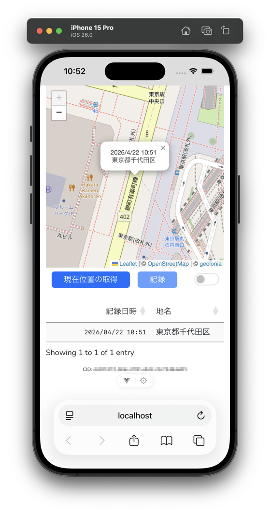

# Location Logger for Cloudflare Workers, D1

Laravel+Vue3で作った位置情報を記録するSPAの習作を、Cloudflare WorkersとD1を使って実装し直しました。

- Cloudflare Workers
- Cloudflare D1
- フロントエンド: Vue
  - Leaflet, @geolonia/open-reverse-geocoderなどを使用
- バックエンド: Hono + drizzle



## セットアップ

```bash
# パッケージのインストール
npm i

# D1データベースの作成: wrangler.jsoncの"d1_databases"を削除してから実行する
npx wrangler d1 create location_logger_db --binding DB --use-remote

# Workerコンフィグレーションから型を生成する: .envがあるとEnvインターフェースに追加されてしまう点に注意
npx wrangler types
```

`drizzle.config.ts`で使用する[環境変数の値](https://orm.drizzle.team/docs/guides/d1-http-with-drizzle-kit)を`.env`に保存します。各設定値は、Cloudflareにログインしてダッシュボード画面で取得できます。

```.env
CLOUDFLARE_ACCOUNT_ID=<Workers & PagesのAccount Detailsに記載されているAccount ID>
CLOUDFLARE_DATABASE_ID=<上記コマンドで作成したD1データベースのdatabase_id (UUID)>
CLOUDFLARE_D1_TOKEN=<マイプロフィールでD1の編集権を備えたカスタムAPIトークンを作成する>
```

`drizzle/schema.ts`で定義したテーブルのマイグレーションファイルを`drizzle/migrations`フォルダー内に生成してD1データベースに反映します。これは、`drizzle/schema.ts`を変更する度に行います。

```bash
# マイグレーションファイルを生成する (drizzle/migrations)
npx drizzle-kit generate

# D1データベースにマイグレーションを実行する
npx drizzle-kit migrate

# D1データベースにテーブルができていることを確認する
npx wrangler d1 execute location_logger_db --remote --command "SELECT tbl_name, sql FROM sqlite_schema WHERE type ='table';"
```

## デバッグ

`npx wrangler dev`を使うと`./dist`配下のプログラムで起動するため、デバッガをアタッチするとソースコードのブレークポイントが無効になります。

`npm run dev`を使えば、デバッガをアタッチしたときにソースコードに設定したブレークポイントが有効になります。

デバッガのポート番号は、`vite.config.ts`の`cloudflare`プラグインにパラメータを指定して変更できます。

```vite.config.ts
  plugins: [
    vue(),
    vueDevTools(),
    cloudflare({
      inspectorPort: 19229, /* デバッガがアタッチするポート番号 */
    })
  ],
```

なお、デバッグ時もD1データベースを使用するため、通信や使用量に配慮する必要があります。

## デプロイ

事前に`npm run build`でビルドが正常にできることを確認してからデプロイします。

```bash
npm run deploy
```
